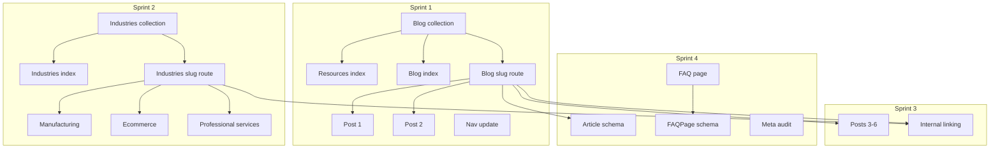

# Nexrena Prioritized Backlog — Sprint Prioritizer Deliverable

**Agent:** @sprint-prioritizer  
**Date:** 2025-03-10  
**Inputs:** UX Architect site map, SEO Specialist keyword map, Content Creator editorial plan  
**Status:** Approved for implementation

---

## 1. Prioritized Backlog (RICE Summary)

| ID | Item | Reach | Impact | Confidence | Effort | RICE | Sprint |
|----|------|-------|--------|------------|--------|------|--------|
| B1 | Blog content collection + schema | 100 | 3 | 100% | 0.5 | 600 | 1 |
| B2 | /resources index page | 100 | 2 | 100% | 0.5 | 400 | 1 |
| B3 | /resources/blog index page | 100 | 2 | 100% | 0.5 | 400 | 1 |
| B4 | /resources/blog/[slug] dynamic route | 100 | 3 | 100% | 1 | 300 | 1 |
| B5 | Pilot blog post 1 (B2B Website Redesign) | 80 | 2 | 90% | 0.5 | 288 | 1 |
| B6 | Pilot blog post 2 (SEO for Manufacturers) | 80 | 2 | 90% | 0.5 | 288 | 1 |
| B7 | Industries content collection + schema | 80 | 2 | 100% | 0.25 | 640 | 2 |
| B8 | /industries index page | 80 | 2 | 100% | 0.5 | 320 | 2 |
| B9 | /industries/[slug] dynamic route | 80 | 3 | 100% | 1 | 240 | 2 |
| B10 | Industry: manufacturing | 60 | 2 | 90% | 0.5 | 216 | 2 |
| B11 | Industry: ecommerce | 60 | 2 | 90% | 0.5 | 216 | 2 |
| B12 | Industry: professional-services | 60 | 2 | 90% | 0.5 | 216 | 2 |
| B13 | Blog posts 3–6 (weeks 3–6 from calendar) | 70 | 2 | 85% | 2 | 59 | 3 |
| B14 | Internal linking pass (blog ↔ services ↔ industries) | 100 | 1 | 90% | 0.5 | 180 | 3 |
| B15 | /resources/faq page | 60 | 2 | 80% | 1 | 96 | 4 |
| B16 | Article schema on blog posts | 100 | 1 | 100% | 0.25 | 400 | 4 |
| B17 | FAQPage schema (if FAQ exists) | 60 | 1 | 90% | 0.25 | 216 | 4 |
| B18 | Meta/OG audit for new page types | 100 | 1 | 100% | 0.5 | 200 | 4 |
| B19 | Nav + footer update (Industries, Resources) | 100 | 2 | 100% | 0.25 | 800 | 1 |

---

## 2. Sprint Roadmap

### Sprint 1: Foundation (Weeks 1–2)

**Goal:** Blog infrastructure and 2 pilot posts live.

| Task | Depends On | Deliverable |
|------|------------|-------------|
| B1 | — | `blog` collection in config.ts |
| B2 | B1 | /resources index |
| B3 | B1 | /resources/blog index |
| B4 | B1 | /resources/blog/[slug].astro |
| B5 | B4 | First blog post MDX |
| B6 | B4 | Second blog post MDX |
| B19 | — | Nav.astro, Footer.astro updated |

**Success criteria:** /resources and /resources/blog load; 2 posts visible; nav shows Resources.

### Sprint 2: Industries (Weeks 3–4)

**Goal:** Industry landing pages live.

| Task | Depends On | Deliverable |
|------|------------|-------------|
| B7 | — | `industries` collection or data |
| B8 | B7 | /industries index |
| B9 | B7 | /industries/[slug].astro |
| B10 | B9 | manufacturing content |
| B11 | B9 | ecommerce content |
| B12 | B9 | professional-services content |

**Success criteria:** /industries loads; 3 industry pages live; nav shows Industries.

### Sprint 3: Scale Content (Weeks 5–8)

**Goal:** 6+ blog posts; internal linking.

| Task | Depends On | Deliverable |
|------|------------|-------------|
| B13 | B4 | 4 additional blog posts |
| B14 | B4, B9 | Internal links in templates |

**Success criteria:** 6+ posts; each post links to 1+ service/industry; services link to industries.

### Sprint 4: Polish (Weeks 9–10)

**Goal:** FAQ, schema, meta audit.

| Task | Depends On | Deliverable |
|------|------------|-------------|
| B15 | — | /resources/faq page |
| B16 | B4 | Article schema on blog layout |
| B17 | B15 | FAQPage schema |
| B18 | B4, B9, B15 | Meta/OG for all new types |

**Success criteria:** FAQ live; Article + FAQPage validate; all new pages have unique meta.

---

## 3. Dependency Map

---

## 4. Success Criteria by Phase

| Sprint | Metric | Target |
|--------|--------|--------|
| 1 | New indexable pages | 4 (/resources, /resources/blog, 2 posts) |
| 2 | New indexable pages | 4 (/industries, 3 industry pages) |
| 3 | Blog posts live | 6+ |
| 3 | Internal links per post | ≥ 2 to services/industries |
| 4 | Schema validation | Article, FAQPage pass |
| 4 | Meta coverage | 100% of new pages |
